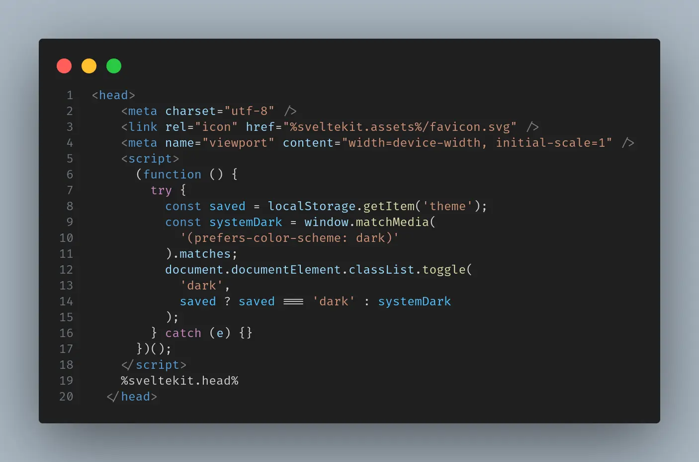

# The Rundown

## Motivation

I've decided to build my website with svelte because it is easy to use and setup, and a trial would make you abandon other frameworks. Due to my laziness, I have thought deeply about the tools to use and decided to use these tools that's easy to setup (a scenario where laziness is an advantage).

## Problems I Faced

The theme was on of the first things I worked on in the project because I wanted to get it out of the way as early as possible.

- Tailwind dark mode: Struggled with putting the function together even though I had the right idea of how it should be implemented. Despite my gluing the logic together, I noticed a FOUC before a dark theme is applied. I did further research and saw that I could put a function in the header of the app.html file, I tried it and it worked.
  This is the code as at the time I was working on the theme
  

## Project Goals

- A blog and a portfolio
- DX & speed
- Authoring convenience
- Collaborate on posts

## Design Philosophy

- Ease of use as a base for better engineering practice not trendy features
- Why building for the future means using simple tools today
- Tradeoffs
- Add KV Cache to reduce load on DB

## Stack Overview

- Framework: SvelteKit - simple, fast & easy to use
- Styling: Tailwind - simple and useful for fast prototyping
- Hosting: CF Pages
- Content Rendering: MDX with mdsvex & database
- Analytics: CF Analytics
- Image Optimization: @unpic/svelte
- Database: Turso

## Great Additions

- Benchmarking: LightHouse + bundle size
- Screenshots/GIFs: Show terminal, build or local preview
- Tooling: vite
- Privacy Notes: I avoid GA4 analytics even though I needed to track my analysis diligently
- Meta-developer insight: This is my first time using svelte and sveltekit

## Code Snippets or GitHub Link
